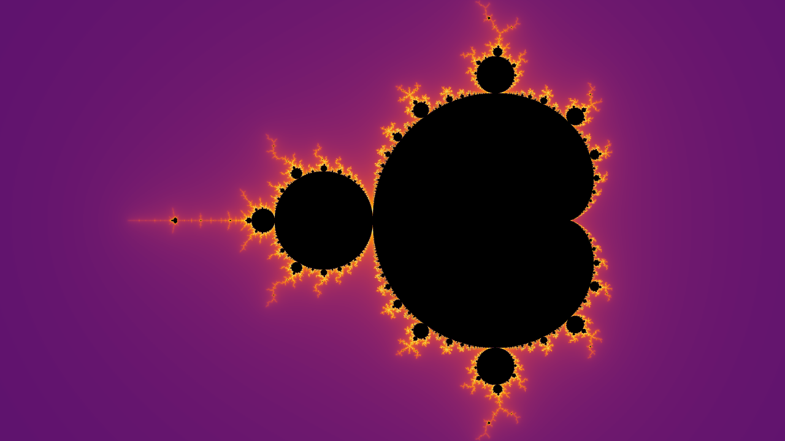
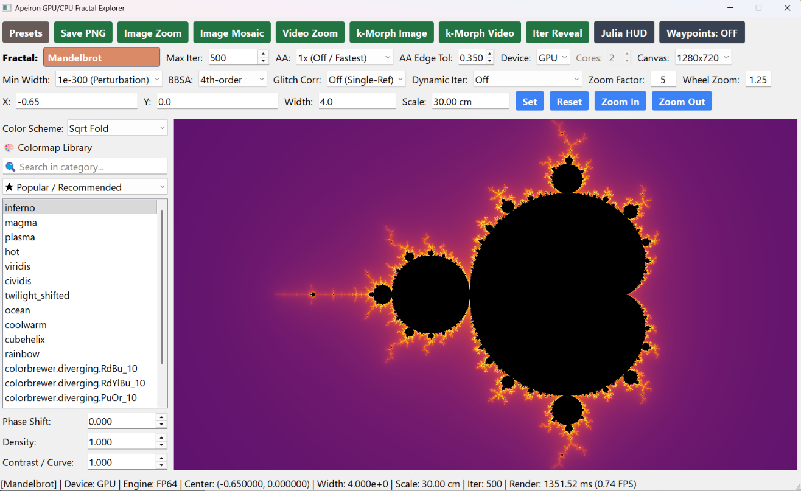

# Apeiron — High-Performance GPU & Multi-Core CPU Fractal Explorer

<p align="center">
  
  
  
  
  
</p>

<p align="center">
  
</p>

**Apeiron** is an advanced, real-time fractal visualization and rendering application designed for ultra-deep-zoom exploration down to $10^{-646,000,000}$. Powered by NVIDIA CUDA and multi-core CPU Numba JIT kernels, Apeiron provides continuous real-time navigation, chained bilinear approximation (BLA), Taylor series acceleration (BBSA), dynamic exponent scaling (FloatExp), automated glitch detection and reference rebasing, real-time palette phase shifting, multi-waypoint spline fly-throughs, and multi-format ultra-high-resolution image/video export, scale-space arc-length camera pathing, and HDR10/HLG support.

---

## Key Features

### 1. Multi-Precision Computational Engine
* **FP64 (Standard 64-bit IEEE Floats)**: Real-time overview exploration ($w \ge 10^{-12}$) at $> 100$ frames per second.
* **Double-Double (DD / 106-bit Floating Point)**: Native Dekker-split arithmetic providing ~31 decimal digits of precision ($10^{-12} \le w \ge 10^{-24}$) without arbitrary-precision overhead.
* **Arbitrary-Precision Perturbation Theory**: High-precision reference orbit calculations with GMPY2 / Decimal coupled with high-speed perturbation iterations ($10^{-300} \le w < 10^{-12}$).
* **FloatExp Dynamic Exponent Scaling**: Subnormal-free scaled exponent perturbation ($\Delta z \cdot 2^{E_{\text{scale}}}$) unlocking deep zooms potentially down to $w = 10^{-646,000,000}$ without hardware underflow.

### 2. Algorithmic Acceleration & Glitch Correction
* **BBSA (Bivariate Bilinear Series Approximation)**: Dedicated 4th-order and 8th-order Horner-evaluated Taylor polynomial series expansions to skip initial iterations from step 0 within strict error bounds (available for benchmarking and legacy comparison).
* **Chained BLA (Bilinear Approximation)**: Precomputes a hierarchical dyadic leap table along the reference orbit ($L = 2^d$, $d \in [0, 15]$) enabling multi-thousand-step geometric leaps throughout the trajectory within monotonic valid perturbation radii, achieving up to $50\times - 300\times$ speedups over standard perturbation. Fully implemented for Mandelbrot, Burning Ship, Julia sets, and General Mandelbrot ($Z^n + kZ + c$) across both CUDA GPU and multi-core CPU backends.
* **Auto Rebasing**: Multi-pass automatic reference orbit rebasing powered by the Pauldelbrot metric and strict glitch metric, with complete feature and precision parity across standard perturbation ($10^{-12} \to 10^{-300}$) and ultra-deep FloatExp ($10^{-300} \to 10^{-646,000,000}$) on both CUDA GPU and multi-core CPU backends.
* **Strict Metric Fallback**: Multi-threaded high-precision scalar fallback guaranteeing 100% glitch-free deep zooms with full support for General Mandelbrot ($Z^n + kZ + c$), active colormaps, and 16-bit HDR dynamics.

### 3. Dual Compute Backends & Unified Architecture
* **NVIDIA CUDA GPU Backend**: Asynchronous CUDA streams, pinned host memory double-buffering, and zero-allocation scratch buffer pools for maximum frame throughput, accelerating FP64, Double-Double, Perturbation, FloatExp, Chained BLA, and adaptive SSAA.
* **Multi-Core CPU Backend**: Parallel multi-threaded Numba JIT engine supporting FP64, Double-Double, Perturbation, FloatExp, and Chained BLA with full glitch-correction parity and cache-aligned multi-thread supersampling.

### 4. 5 Fractal Formulas & Generalized Smooth Potential
1. **Mandelbrot Set** ($z \leftarrow z^2 + c$) 
2. **Burning Ship Fractal** ($z \leftarrow (|\text{Re}(z)| + i|\text{Im}(z)|)^2 + c$) 
3. **Julia Set (Mandelbrot)** ($z \leftarrow z^2 + j$) 
4. **Julia Set (Burning Ship)** ($z \leftarrow (|\text{Re}(z)| + i|\text{Im}(z)|)^2 + j$) 
5. **General Mandelbrot / Multibrot** ($z \leftarrow z^n + (k_r + i k_i)z + c$) 

### 5. Color Schemes, Real-Time Phase Shifts & Aesthetics
* **12 Continuous Color Transfer Functions**: Sqrt Fold, Logarithmic, Sigmoidal Tanh, Exponential Flare, High-Frequency Ripples, Golden Ratio Dual Sine, Cosine Smooth, Harmonic Cascade, Quintic S-Curve, Chirp Sweep, Soft Damping, and Histogram Equalized. All schemes use smooth periodic folding for seamless $C^0$ continuity without wrap jumps.
* **Adaptive SSAA (up to 8x SSAA)**: 3-pass edge-detection supersampling supporting 1x, 2x, 4x, 6x, and 8x SSAA.
* **16-bit Deep Color / HDR**: Full HDR10 (PQ curve) and 16-bit wide-gamut image/video output.
* **Over 100 Curated Colormaps**: Full integration with Matplotlib, Palettable, cmocean, CartoColors, ColorBrewer2, Cubehelix, and Scientific colormap suites with instant search and a dedicated **★ Popular / Recommended** collection.
* **Real-Time Palette Phase Shifts**: Rotate and animate palette phase contours on the fly in real time via sidebar controls or instant hotkeys (`[` and `]`).
* **Unified 2-Parameter Tuning (Density & Contrast / Curve)**: Dynamically modulate cycle density (frequency $\in [0.001, 10.0]$) and non-linear contrast/curvature response ($\in [0.001, 10.0]$) across all transfer functions in real time with automatic default reset on scheme switch.
* **Dynamic Color Cycling in Videos**: Set rotation speed (`rev/sec`) to continuously animate color cycle transitions throughout exported animations.

### 6. Export Studio
* **Ultra-High Resolution Image Export**: Renders up to 16K+ PNGs with SSAA memory safety diagnostics, 16-bit HDR deep color, and exact Decimal-precision filename tags.
* **Image Zoom (Multi-Waypoint Sequence Export)**: Exports sequenced image frames along deep-zoom trajectories or smoothly interpolates arbitrary multi-point waypoint paths with Catmull-Rom splines.
* **Video Zoom & Image Zoom**: Multi-keyframe camera fly-through paths parameterized by cumulative scale-space arc-length and logarithmic focal tracking for uniform, constant perceived optical velocity across arbitrarily many waypoints.
* **Mosaic / Tile Grid Export**: Multi-tile partitioned rendering with automatic seamless stitching and per-tile telemetry HUD overlays.
* **k-Morph Image Sequence Export**: Exports high-resolution PNG image sequences continuously morphing General Mandelbrot $k = k_r + i k_i$ parameters across user-defined ranges.
* **Parameter Morphing Video**: Smooth animations morphing General Mandelbrot power $n$ and complex constant $k = k_r + i k_i$ across time.
* **Iteration Reveal Timelapse**: Sweeps `Max Iter` (e.g. $10 \to 1,000,000$) on fixed coordinates across logarithmic or polynomial curves to visualize fractal structures progressively crystallizing into existence.
* **Live Calculation Preview HUD (256x144)**: Optional live thumbnail HUD embedded directly inside export dialogs showing calculated frames in real time with dynamic mid-render toggling.
* **Constant Rate Factor (CRF) Quality Mode**: Switch between Target Bitrate (kbps) and visually lossless CRF encoding (CRF 14–18) across NVENC, libx264, libx265, libaom-av1, and libvpx-vp9 encoders.
* **Top-Left Telemetry HUD Badge**: Compact, semi-transparent glassmorphic badge rendering `Center: (X, Y) | Width: W | Scale: S` directly onto image frames, tiles, and videos with symmetrical vertical/horizontal padding. Blended strictly over the local badge ROI to preserve full 16-bit HDR dynamic range without downsampling untouched pixels.
* **Live Julia HUD Inspector**: Real-time live Julia set preview HUD tracking mouse hover coordinates over the complex plane with double-click instant jump.

---

## Installation & Setup

### Prerequisites
* **Python 3.9+** (Anaconda / Miniconda recommended)
* **NVIDIA GPU** with CUDA compute capability $\ge 5.0$ (Optional; multi-core CPU mode included)
* **FFmpeg** (Bundled via `imageio-ffmpeg` or available on your system `PATH`)

### 1. Clone the Repository
```bash
git clone https://github.com/szabolcsmeszaro-arch/Fractura.git
cd Fractura
```

### 2. Install Dependencies
```bash
pip install -r requirements.txt
```
*Or install packages individually:*
```bash
pip install numpy numba PyQt5 matplotlib palettable psutil imageio-ffmpeg pillow
```

*(Optional for 10x faster reference orbit computation on deep zooms):*
```bash
pip install gmpy2
# Or via conda:
conda install -c conda-forge gmpy2
```

---

## Running Apeiron

Launch the desktop explorer directly:
```bash
python apeiron.py
# or
python main.py
```
*(On Windows, you can also double-click `run_apeiron.bat`)*.

## Navigation, Gestures & Hotkeys

| Gesture / Input | Action | Description |
|---|---|---|
| **Left-Click + Drag** | **Pan / Move** | Drag the canvas continuously in any direction across the complex plane. |
| **Mouse Wheel Up** | **Zoom In** | Smooth geometric magnification scaled by the active **Wheel Factor** (default $1.25\times$) centered precisely on your cursor position. |
| **Mouse Wheel Down** | **Zoom Out** | Smooth geometric demagnification scaled by the active **Wheel Factor** (default $1.25\times$) centered precisely on your cursor position. |
| **Right-Click** | **Custom Factor Zoom In** | Rapid magnification centered directly on the cursor coordinate scaled by the active **Zoom Factor** (default $5\times$). |
| **Left Double-Click** | **Julia Jump / Waypoint** | When Julia HUD is visible, jumps viewport into the selected Julia set; when recording video / waypoints, records a keyframe. |
| **`Space`** | **Toggle Live Palette Animation** | Starts or pauses continuous real-time palette phase cycling (safe when typing in input boxes). |
| **`R`** | **Reset Viewport** | Resets viewport center coordinates, width, and iteration budget back to defaults. |
| **`H`** | **Toggle Waypoints Overlay** | Toggles visibility of camera waypoint beacon pins and spline flight trajectories. |
| **`[`** | **Palette Phase Step -** | Shifts the palette phase contour backward by `-0.02` in real time. |
| **`]`** | **Palette Phase Step +** | Shifts the palette phase contour forward by `+0.02` in real time. |
| **Zoom In / Out Buttons** | **Stepped Factor Zoom** | Multiplies or divides viewport width by the configured **Zoom Factor** textbox value. |

---

## Detailed Main Window GUI Reference

<p align="center">
  
</p>

### Row 1: Main Buttons

* **Presets**:
  * Opens the preset manager to browse, load, rename, and jump between curated deep-zoom coordinates, or save and name custom bookmarks exported as JSON. Includes an instant search filter allowing fast live filtering across bookmark titles, descriptions, and fractal types.
* **Export Studio Buttons (with Reactive Amber Busy Feedback)**:
  * **Save PNG**: Renders ultra-high-resolution images (up to 16K+) with 16-bit HDR deep color, memory safety diagnostics, and top-left telemetry HUD overlay.
  * **Image Zoom**: Renders sequential image frames along deep-zoom trajectories or smoothly pans and zooms across arbitrarily many waypoints recorded via double-click on the canvas. Includes live 256x144 calculation preview HUD.
  * **Mosaic Grid**: Renders partitioned tile grids with automatic seamless stitching, memory safety diagnostics, per-tile telemetry HUD overlays, and live 256x144 calculation preview HUD.
  * **Video Zoom**: Unified video generator supporting both direct zoom-in animations and multi-waypoint Catmull-Rom spline camera paths with scale-space arc-length speed and live 256x144 calculation preview HUD.
  * **k-Morph Image**: Exports high-resolution PNG image sequences interpolating General Mandelbrot complex parameters $k = k_r + i k_i$ across user-specified ranges with live calculation preview HUD.
  * **k-Morph Video**: Exports smooth animations morphing polynomial power $n$ and complex constant $k = k_r + i k_i$ across time with live preview HUD.
  * **Iter Reveal**: Sweeps iteration depth across time on fixed coordinates to capture the progressive revelation of fractal filaments.
* **Zoom In / Zoom Out Buttons & Zoom Factor Input**:
  * **Zoom In** and **Zoom Out** buttons scale viewport width by the value set in the **Zoom Factor** textbox (range: `1.0` to `1000.0`, default: `5.0`). The zoom factor also controls the right-click canvas zoom multiplier.
* **Julia HUD**:
  * Toggles the live floating **Julia Set Preview HUD**. When enabled, hovering your mouse anywhere over the Mandelbrot or Burning Ship canvas computes and displays a real-time preview of the Julia set corresponding to that exact complex coordinate ($c$). Double-clicking any point instantly jumps the viewport to that Julia set.
* **Waypoints Overlay (`Waypoints: ON` / `Waypoints: OFF`)**:
  * Toggles the interactive camera flight path overlay displaying numbered beacon pins (`①`, `②`, `③`...) and glowing antialiased Catmull-Rom spline trajectory curves.
  * **Smart Auto-Activation**: Waypoint overlay is off by default and automatically activates whenever **Image Zoom** or **Video Zoom** studio dialogs are opened, turning off when they close.
  * Can be toggled manually at any time via the toolbar button or the <kbd>H</kbd> key.

---

### Video & Image Export Studio & Rate Control

All export modules share a unified, high-performance rendering and encoding pipeline:

* **Scale-Space Arc-Length Pathing**: Multi-keyframe animations and image sequences are parameterized by normalized cumulative scale-space arc-length, guaranteeing uniform perceptual speed regardless of extreme scale differences ($w = 4.0 \to 10^{-646,000,000}$).
* **Live Calculation Preview HUD (256x144)**: Check `[ ] Show Live Calculation Preview (256x144 HUD)` in any export dialog to view thumbnails of calculated frames streaming in real time. Can be toggled dynamically at any time (including mid-render) with zero overhead when unchecked.
* **Dynamic Palette Cycling**: Set `Palette Cycling (rev/sec)` to create hypnotic continuous color rotation animations throughout video exports.
* **Rate Control Modes**:
  * **Constant Rate Factor (CRF)**: Quality-based variable bitrate encoding. Set CRF from `0` (lossless) to `51` (default: `16` for visually lossless output) without manual bitrate calculations.
  * **Target Bitrate (kbps)**: Fixed/average bitrate mode with presets from `5,000` to `100,000` kbps (or custom inputs).
* **Hardware & Software Encoders**:
  * **NVIDIA NVENC**: Hardware-accelerated H.264, HEVC (H.265), and AV1 with `-preset p4 -tune hq -rc vbr -qp <CRF>`.
  * **CPU Software**: High-efficiency `libx264`, `libx265`, `libaom-av1`, and `libvpx-vp9` (WebM).
* **Top-Left Telemetry HUD Overlay**: Embeds a semi-transparent glassmorphic HUD badge at the top-left corner displaying center coordinates, complex plane width, and real-world scale metric (`Center: (X, Y) | Width: W | Scale: S`). 
* **Underflow-Proof Decimal Scientific Formatting**: Viewport width telemetry labels, export dialog readouts, and generated file names maintain full scientific precision (e.g. `_1.000000e-500.png`) even at deep zooms beyond IEEE 754 limits ($< 10^{-308}$).
* **Pre-Flight Memory Safety Diagnostics**: Accurate quadratic sample scaling ($S^2$) estimates scratch RAM requirements for up to 8x SSAA supersampling, warning the user before high-resolution multi-pass exports begin.
* **HDR10 & HLG 10-Bit Color**:
  * Native 10-bit wide-gamut BT.2020 color pipeline with SMPTE ST 2084 (PQ) and ARIB STD-B67 (HLG) mastering metadata.
* **VRAM Lifecycle Management**: Closing any export dialog automatically cancels background render threads and releases GPU scratch device arrays, guaranteeing zero VRAM leaks across high-resolution (4K/8K/16K) exports.

---

### Row 2: Formula, Iteration Budget & Color Schemes

* **Fractal Type**:
  * **Mandelbrot**: Classic $z \leftarrow z^2 + c$ quadratic polynomial (default center: `(-0.65, 0.0)`, width: `4.0`).
  * **Burning Ship**: Non-analytic absolute value variant $z \leftarrow (|\text{Re}(z)| + i|\text{Im}(z)|)^2 + c$ (default center: `(-0.45, 0.5)`, width: `3.5`).
  * **Julia Set (Mandelbrot)**: Julia set parameterized by constant complex seed $c = j_x + i j_y$ (default seed: `-0.67 + 0.37i`, center: `(0.0, 0.0)`, width: `3.5`).
  * **Julia Set (Burning Ship)**: Burning Ship Julia set parameterized by $c = j_x + i j_y$ (default seed: `0.35 - 0.05i`, center: `(0.0, 0.0)`, width: `4.0`).
  * **General Mandelbrot**: Generalized multi-degree polynomial with complex linear drift $z \leftarrow z^n + (k_r + i k_i)z + c$ (default center: `(0.0, 0.0)`, width: `4.0`, $n = 3, k = 0.25 + 1.0i$).
* **Max Iter**:
  * Sets the escape-time iteration ceiling (configurable default: `DEFAULT_MAX_ITER = 500`, maximum: `GLOBAL_MAX_ITER = 500,000,000`). Higher values resolve intricate filaments and boundary details in deep zooms.
* **AA (Antialiasing / SSAA Factor)**:
  * **1x (Off / Fastest)**: Single sample per pixel for maximum real-time interactive framerate.
  * **2x (SSAA)**: 4 sub-pixel samples evaluated on boundary edges detected by the edge-detection pass.
  * **4x (SSAA)**: 16 sub-pixel samples evaluated on detected edges for publication-grade edge fidelity.
  * **6x (SSAA)**: 36 sub-pixel samples evaluated on detected boundary edges.
  * **8x (SSAA / Slowest)**: 64 sub-pixel samples for extreme ultra-high-definition smoothing.
* **AA Edge Tol (Antialiasing Edge Tolerance)**:
  * Configures the edge-detection derivative threshold (range: `0.001` to `2.000`). Smaller values trigger supersampling on subtle color transitions, while higher values restrict SSAA only to sharp high-contrast boundary silhouettes.

---

### Row 3: Mathematical Precision, Perturbation & Scalability

* **Min Width (Precision Mode)**:
  * **1e-12 (FP64)**: Standard IEEE 64-bit hardware floats. Ultra-fast overview exploration down to $10^{-12}$.
  * **1e-24 (DD)**: 106-bit Double-Double Dekker arithmetic providing ~31 decimal digits ($10^{-12} \le w \ge 10^{-24}$) without arbitrary-precision performance penalties.
  * **1e-300 (Perturbation)**: Arbitrary-precision reference orbit calculation with Taylor series perturbation down to $10^{-300}$. Navigation is strictly clamped to $10^{-300}$. Operates on a tiered hierarchy using hardware FP64 above $10^{-12}$, standard fast perturbation between $10^{-12}$ and $10^{-300}$.
  * **1e-10000+ (Floatexp)**: Unlocks extreme deep zoom exploration down to $w = 10^{-646,000,000}$. Operates on a tiered hierarchy using hardware FP64 above $10^{-12}$, standard fast perturbation between $10^{-12}$ and $10^{-300}$, and dynamically scaled FloatExp perturbation below $10^{-300}$. 
* **BBSA (Bivariate Bilinear Series Approximation)**:
  * **Off**: Standard step-by-step perturbation recurrence iteration.
  * **4th-order**: Evaluates a dedicated 4th-order Horner Taylor series expansion, skipping hundreds of iterations per pixel within strict error tolerances ($\epsilon \le 10^{-4}$).
  * **8th-order**: Evaluates an 8th-order Horner Taylor series expansion, skipping thousands of iterations in a single evaluation step.
  * **Chained BLA**: State-of-the-art hierarchical dyadic bilinear approximation leap table ($L = 2^d$), skipping multi-thousand-step blocks throughout the trajectory at up to $50\times - 300\times$ speedups across Mandelbrot, Burning Ship, Julia sets, and General Mandelbrot on both CUDA GPU and multi-core CPU.
* **Glitch Corr (Glitch Detection & Healing)**:
  * **Off (Single-Ref)**: Standard perturbation using a single central reference orbit.
  * **Pauldelbrot**: Automatically detects glitching pixels using the Pauldelbrot metric and performs multi-pass reference orbit rebasing to heal artifacts on both Perturbation and FloatExp backends across CUDA GPU and multi-core CPU.
  * **Strict Metric**: Multi-pass rebasing combined with an exhaustive multi-threaded high-precision scalar fallback for any residual glitch pixels, guaranteeing 100% artifact-free renders across all fractal formulas (including General Mandelbrot) and color schemes.
* **Dynamic Iter (Adaptive Iteration Scaling)**:
  * **Off**: Strict adherence to the manual `Max Iter` value.
  * **On (Sqrt Scaling)**: Dynamically scales iterations continuously based on logarithmic zoom depth with a square root growth factor ($1 + 0.85\sqrt{\log_{10}(4/w)}$).
  * **On (Linear Scaling)**: Scales iteration depth smoothly and linearly with magnification depth ($1 + 0.35\log_{10}(4/w)$).
  * **On (Adaptive Preview)**: Probes a low-resolution sampling grid across the current view and computes the exact iteration threshold required to resolve visible structures.
* **Canvas (Viewport Resolution)**:
  * Changes the interactive rendering canvas size (`480x270`, `640x360`, `960x540`, or `1280x720`).

---

### Row 4: Viewport Coordinates & Real-World Physical Scale Navigation

* **Center X ($c_x$) & Center Y ($c_y$)**:
  * High-precision decimal string inputs for the center coordinate of the viewport. Supports full copy/paste of arbitrary-precision coordinates with hundreds of digits.
* **Width ($w$)**:
  * Horizontal span of the viewport in the complex plane ($4.0$ down to $10^{-646,000,000}$).
* **Scale (Physical & Astronomical Scale Input)**:
  * Interactive text box displaying and parsing real-world physical scale units directly. You can type any metric or astronomical scale (e.g. `10 AU`, `4.2 ly`, `500 km`, `50 m`, `30 cm`) and press Enter or click **Set** to automatically set the corresponding complex plane width. Supported units:
    * **Astronomical**: Universe (`U`), Milky Way (`MW`), Light-Years (`ly`), Astronomical Units (`AU`)
    * **Metric**: Kilometers (`km`), Meters (`m`), Centimeters (`cm`).
* **Julia Parameters ($j_x, j_y$)**:
  * Dynamically displayed when a Julia set fractal type is active; defines the fixed complex seed $c = j_x + i j_y$ (default: `-0.67, 0.37` for Mandelbrot Julia; `0.35, -0.05` for Burning Ship Julia).
* **General Mandelbrot Parameters ($n, k_r, k_i$)**:
  * Dynamically displayed when General Mandelbrot is active; configures the polynomial power exponent $n$ and complex coefficient $k = k_r + i k_i$.

---

### Sidebar: Compute Engine & Colormap Library

* Located on the right-hand panel:

* **Color Scheme (Continuous Transfer Functions)**:
  * Maps continuous normalized escape iteration values ($s$) into smooth cyclic palette lookups:
    1. **Sqrt Fold**: Balanced square-root folded palette distribution.
    2. **Logarithmic**: Broad dynamic range for high-iteration fields.
    3. **Sigmoidal Tanh**: High-contrast dramatic banding.
    4. **Exponential Flare**: Bright glowing highlights near boundary filaments.
    5. **High-Frequency Ripples**: Ultra-dense micro-contour waves.
    6. **Golden Ratio Dual Sine**: Harmonious irrational-ratio interference waves.
    7. **Cosine Smooth**: Classic harmonic sinusoidal wave.
    8. **Harmonic Cascade**: Multi-harmonic cascading frequencies.
    9. **Quintic S-Curve**: Smooth polynomial transition with soft falloffs.
    10. **Chirp Sweep**: Frequency-modulated chirped color oscillations.
    11. **Soft Damping**: Gentle low-contrast pastel gradients.
    12. **Histogram Equalized**: Real-time cumulative distribution function (CDF) equalized color mapping. Calculates screen-space iteration histograms on the GPU/CPU to ensure every color in the palette occupies equal visual area, automatically maximizing contrast across deep filament fields. 

* **Compute Engine (Device & Cores)**:
  * **Device (`GPU` / `CPU`)**:
    * **GPU (Recommended)**: Massive parallel rendering using NVIDIA CUDA kernels, asynchronous streams, and pinned host memory.
    * **CPU**: Multi-core parallel rendering across all available CPU cores using Numba `prange` JIT with cache-aligned thread chunking.
  * **Cores (Thread Count)**:
    * Active when `CPU` device is selected. Configures the number of parallel worker threads allocated for CPU rendering (up to the system's maximum hardware thread count).
* **🎨 Colormap Library & Real-Time Color Tuning**:
  * **Searchable Colormap Categories**: Over **100 curated scientific and aesthetic colormaps** (**★ Popular / Recommended**, **Matplotlib Standard**, **cmocean**, **CartoColors**, **ColorBrewer2**, **Cubehelix**, **MyCarta**, **Scientific**, **Tableau**).
  * **Phase Shift Spinner**: Live control adjusting palette phase offset in real time with instant hardware LUT transformation.
  * **Density Spinbox (`0.001` to `10.000`, default `1.000`)**: Controls wave frequency and cycle repetitions across all color schemes.
  * **Contrast / Curve Spinbox (`0.001` to `10.000`, default `1.000`)**: Controls non-linear response curves, power-law contrast, and harmonic distribution. Automatically resets to default `1.0` when switching schemes.
  * **Hotkeys**: Press `[` or `]` to shift phase contours while navigating.

---

## Status Bar Telemetry & Real-Time Diagnostics

The bottom status bar provides continuous, real-time diagnostic telemetry:

```
[Mandelbrot] | Device: GPU | Engine: FP64 | Center: (-0.743644, +0.131826) | Width: 4.000e+00 | Scale: 1.92e+22 km | Iter: 500 | Render: 1.25 ms (800.00 FPS)
```

| Metric Field | Description |
|---|---|
| **Fractal / Preset Title** | Displays the active fractal name or loaded bookmark title (e.g. `[Mandelbrot]`). |
| **Compute Device Tag** | Indicates the active backend: `Device: GPU` or `Device: CPU (16T)` with thread count. |
| **Active Engine Tag** | Displays the real-time math engine executing the current frame: `Engine: FP64`, `Engine: Double-Double`, `Engine: Perturbation`, or `Engine: FloatExp`. |
| **Center Coordinates** | Formatted $(c_x, c_y)$ coordinates of the current viewport center. |
| **Width ($w$)** | Scientific notation zoom diameter in the complex plane (e.g. `1.000e-45`). |
| **Real-World Scale** | Relative physical scale comparison assuming a 30 cm desktop monitor, seamlessly converting complex widths into real-world units down to centimeters: <br>• **Universe ($U$)**: The diameter of the observable Universe ($8.80\times 10^{26}\text{ m}$)<br>• **Milky Way ($MW$)**: The diameter of the Milky Way ($9.46\times 10^{20}\text{ m}$)<br>• **Light-Years ($ly$)**: The distance light travels in a year <br>• **Astronomical Units ($AU$)**: Earth orbital radii around the Sun<br>• **Kilometers ($km$) / Meters ($m$) / Centimeters ($cm$)**: Macroscopic real-world metrics (down to a minimum unit of **cm**). |
| **Iteration Telemetry** | Displays base iteration budget and dynamic effective iteration count (e.g. `Iter: 500 -> 1250`). |
| **Render Benchmark** | Kernel compute time in milliseconds and real-time interactive framerate (e.g. `Render: 1.25 ms (800.00 FPS)`). |

---

## Project Structure

```
apeiron/
├── color_engine.py       # Colormap harvesting, LUT generation, and color transforms
├── config.py             # Global precision parameters, color schemes, and system constants
├── apeiron.py            # Application entrypoint
├── fractura.py           # Compatibility alias
├── main.py               # Alternative application launcher
├── presets.json          # Curated bookmark coordinates and presets
├── requirements.txt      # Python package runtime dependencies
├── run_apeiron.bat       # 1-click Windows launcher
├── math_core/
│   ├── cpu_kernels.py    # Numba multi-core CPU kernels (FP64, DD, Perturbation, FloatExp, Chained BLA, BBSA)
│   ├── cuda_kernels.py   # CUDA GPU device math, rendering kernels, FloatExp, Chained BLA, and edge detection
│   ├── engine.py         # Primary dispatcher, dynamic iteration probing, and scratch buffer pools
│   └── high_precision.py # Reference orbits (GMPY2/Decimal), FloatExp, BLA leap tables, Taylor expansion, and DD
├── ui/
│   ├── canvas.py         # Interactive Qt canvas, drag-panning, and HUD Julia preview
│   ├── dialogs_export.py # Export dialogs (PNG, sequences, mosaic grids, video studio, k-morph, iter reveal)
│   ├── dialogs_presets.py# Bookmarks and preset browser with in-place renaming & persistence
│   └── main_window.py    # Main GUI control panel, toolbar layout, and status bar
└── workers/
    ├── base.py           # Background worker thread abstraction and FFmpeg pipe streaming engine
    ├── image_workers.py  # Asynchronous workers for image, sequence, mosaic, and k-morph image exports
    └── video_workers.py  # Unified path interpolation, morphing, and iteration reveal video workers
```

---

## License

Distributed under the MIT License. See `LICENSE` for more information.
